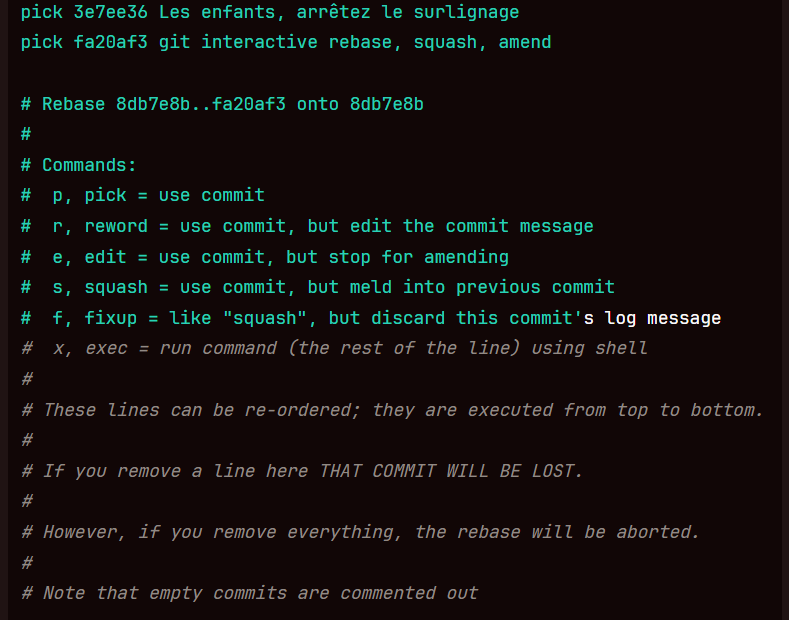

Les branches doivent suivre la nomenclature kebab case et etre précédé du type => feat ou fix ou chore/nom-de-ma-branche
Les commits doivent suivre la nomenclature => "type: description du commit", ici obligatoire et surveillé par commitlint, qui empêchera le commit s'il ne suit pas ce modèle

La statégie de merge sur la branche principale doit etre définie => merge ou rebase
Quand sont lancer les tests ?
Quand l'application est elle déployée et comment?

stratégies de réécriture de l'historique : il y aura toujours un moment ou une PR est en conflit avec un merge récent sur la branche partagée, car le temps a passé entre la création de la PR et son propre merge
Pour éviter une complexité accru, un stress inutile et/ou une potentielle perte de travail, il faut que le travail en local de notre branche soit "propre". Un rebase de gestion de conflit va passer les commits avec lesquels il y a un conflit un à un afin de permettre de selectionner ce que l'on souhaite conserver.

"git reset <numero de commit>" permet en local de reset soft et ainsi d'annuler les commits jusqu'au commit mentionné pour pouvoir ensuite refaire des commits propres, cela permet de ne pas revenir sur le changement effectué dans un commit sur un autre commit et ainsi de bien séparer le cas traité par chaque commit de façon claire. Il peut etre combiné de facon efficace grace au "git add -i" qui permet de stage de façon intéractive afin de choisir quels éléments d'un meme fichier l'on souhaite sélectionner pour le commit que nous sommes en train de préparer. "git diff" aide à avoir un aspect visuel du contenu de notre futur commit.
Il est parfois utile de reset jusqu'au dernier commit ne nous appartenant pas et merge sur la branche de référence d'origine. cela peut s'avéréer utile quand on se retrouve avec des changements qu'ont effectué d'autres personnes sur leur commit et qui apparissent comme faisant partie du notre (etrange mais ça arrive parfois). Dans ce cas on ne reprendra que ce qui correspond à notre travail, pour rebase avec la branche de référence et ainsi faire une PR à jour et cohérente.

Rmq:
Si la PR avait déjà été créée il faudra opérer un git push --force après la création de la PR pour réécrire l'historique de l'origine. L'option force peut etre utiliser sans trop de crainte si c'est sur une branche qui nous appartient exclusivement et qu'il n'y a donc que notre travail car on ne risque pas d'écraser le travail de nos pairs. Faire très attention quand on l'utilise sur une branche partagée.

Quand nous somme sur un travail et que nous souhaitons avoir un commit pour s'assurer de notre code à un instant T tout en continuant de travailler pour du contenu qui ira dans ce commit, nous pouvons dans un premier temps créer un commit avec un titre explicite qui expliquera le but de ce commit (meme s'il n'est pas encore atteint) puis faire par la suite un "git commit --amend --no-edit" pour y ajouter ces changements sans devoir faire un nouveau commit.
Celà est aussi très utile lors de retours sur le code qui se trouve sur une PR que l'on a faite, pour éviter de faire pleins de petits commit de fix suite à ces échanges. Il faudra dans ce cas git push --force, puisqu'on souhaitera réécrire l'historiquue distant.

On souhaite aussi parfois en local, modifier le dernier commit
en supprimant un fichier du commit par exemple
"git rm notes.txt"
et en modifiant sa dercriptionb (qui ouvrira un éditeur pour effectuer le changement)
"git commit --amend"

Il est parfois necessaire d'avoir une console intéractive concernant ses commits, afin d'y effectuer certaines actions:
Dans notre branche si l'on souhaire avoir un rebase interactif de nos commits, il faudra utiliser la commande:
"git rebase -i <HEAD~nombre de commit à sélectionnner, en partant du plus récent, "git log" peut aider à y voir plus clair concernant les commits>
S'il ne se passe rien c'est peut etre que le mauvais editeur est selectionné. Pour le modifier:
"git config --global core.editor "vim""
Sinon vous devriez avoir une interface ressemblant à l'image suivante

Cela met en évidence le fait qu'il est important qu'une PR ne "traine pas trop longtemps ouverte car plus on attend plus il y a de chance que quelqu'un d'autre merge et que cela cré de nouveaux conflits. Il est cependant très important de ne pas bacler la relecture de PR. Chaque PR est une bonne occasion d'améliorer sa qualité de code (grâce aux conseils de nos pairs), d'éviter des bugs (manque d'une condition), d'homogénéiser la méthode de travail (facilite la lecture du code pour tous). Il ne faut aussi pas oublier que lors de problème avec une PR merge, "toute la chaine est responsable", donc autant le dev que celui qui a validé la PR, donc méfiance !
Il y a pratiquement toujours un petit quelque chose à changer ou une question de compréhension à poser sur une PR donc une validation d'emblé est assez rare de mon expérience.

La rapidité de review d'une PR est à définir avec l'équipe comme une règle à suivre. Exemple, qu'au moins 1 personne ait relu une PR ouverte dans les 24h. Il est important d'avoir des retours rapidement afin d'effectuer les potentiels changements nécessaire et ainsi ne pazs avoir de PR ouverte trop longtemps. Cela minimise les conflits ainsi que les intéruptions de travail et les potentielles latences pour le commancement d'une US dont la PR ouverte est une dépendance.
